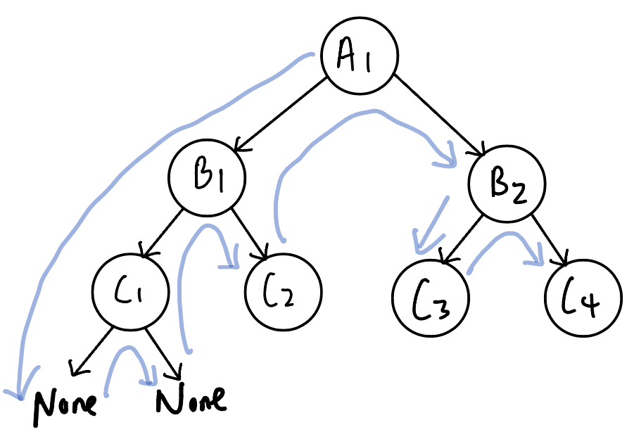

# 144. Binary Tree Preorder Traversal
### way 1: recursive approach
```PYTHON
def preorderTraversal(self, root: Optional[TreeNode]) -> List[int]:
    def recur(curr):
        if not curr:
            return []
        
        return [curr.val] + recur(curr.left) + recur(curr.right)

    return recur(root)
```
### way 2: recursive approach with result list as input to recur function
```PYTHON
def preorderTraversal(self, root: Optional[TreeNode]) -> List[int]:
    def recur(curr,res_list):
        if not curr:
            return
        
        res_list.append(curr.val)
        recur(curr.left, res_list)
        recur(curr.right, res_list)

    res_list = []
    recur(root,res_list)
    return res_list
```
### way 3: iterative approach with stack
```PYTHON
def preorderTraversal(self, root: Optional[TreeNode]) -> List[int]:
    stack = [root]
    res_list = []
    while stack:
        curr = stack.pop()
        if curr:
            res_list.append(curr.val)
            stack.append(curr.right)
            stack.append(curr.left)

    return res_list
```

# 145. Binary Tree Postorder Traversal
### way 1: recursive approach
```PYTHON
def postorderTraversal(self, root: Optional[TreeNode]) -> List[int]:
    def recur(curr):
        if not curr:
            return []
        
        return recur(curr.left) + recur(curr.right) + [curr.val]

    return recur(root)
```
### way 2: recursive approach with result list as input to recur function
```PYTHON
def postorderTraversal(self, root: Optional[TreeNode]) -> List[int]:
    def recur(curr, res_list):
        if not curr:
            return 
        
        recur(curr.left, res_list)
        recur(curr.right, res_list)
        res_list.append(curr.val)

    res_list = []
    recur(root, res_list)
    return res_list
```

### way 3: iterative approach
```PYTHON
def postorderTraversal(self, root: Optional[TreeNode]) -> List[int]:
    if not root:
        return []

    stack = [root]
    res_list = []
    while(stack):
        curr = stack.pop()
        if curr:
            res_list.append(curr.val)
            stack.append(curr.left)
            stack.append(curr.right)

    return res_list[::-1]
```
# 94. Binary Tree Inorder Traversal
### way 1: 
```PYTHON
def inorderTraversal(self, root: Optional[TreeNode]) -> List[int]:
    def recur(curr):
        if not curr:
            return []

        return recur(curr.left) + [curr.val] + recur(curr.right)

    return recur(root)
```
### way 2: result list as input to recur function
```PYTHON
def inorderTraversal(self, root: Optional[TreeNode]) -> List[int]:
    def recur(curr, res_list):
        if not curr:
            return 

        recur(curr.left, res_list)
        res_list.append(curr.val)
        recur(curr.right, res_list)

    res_list = []
    recur(root, res_list)
    return res_list
```
### way 3: iterative approach
```PYTHON
def inorderTraversal(self, root: Optional[TreeNode]) -> List[int]:
    if not root:
        return []
    
    stack = []
    res_list = []
    curr = root

    while(curr or stack):
        if curr:
            # keep exploring left branch
            stack.append(curr)
            curr = curr.left
        else:
            # reach leaf node
            # add the val to result list, then explore right branch
            curr = stack.pop()
            res_list += [curr.val]
            curr = curr.right
    return res_list
```
  

##### TODO: 二叉树的统一迭代法