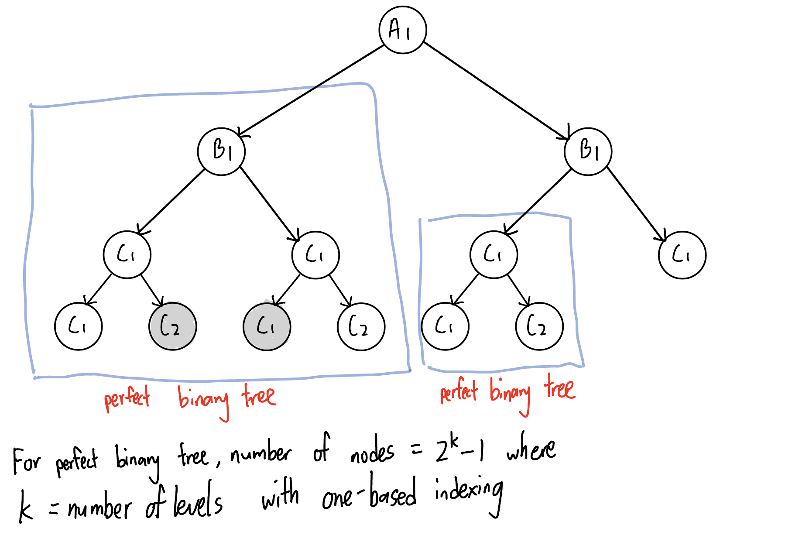

# 559. Maximum Depth of N-ary Tree
The maximum depth of a n-nary tree is equal to the height of the root node. (see more details on [104. Maximum Depth of Binary Tree](./Day13_bfs_binary_tree.md/#104-maximum-depth-of-binary-tree))
### way 1: recursive approach (dfs in post order)
```PYTHON
def maxDepth(self, root: 'Node') -> int:
    def get_height(curr):
        if not curr:
            return 0
        
        max_depth = 0
        for child in curr.children:
            child_height = get_height(child) 
            if child_height > max_depth:
                max_depth = child_height
        
        return 1 + max_depth
    
    return get_height(root)
```
### way 2: iteractive approach (bfs)
```PYTHON
"""
# Definition for a Node.
class Node:
    def __init__(self, val=None, children=None):
        self.val = val
        self.children = children
"""
from collections import deque
class Solution:
    def maxDepth(self, root: 'Node') -> int:
        if not root:
            return 0

        queue = deque([root])
        depth = 0
        while queue:
            size = len(queue)
            depth += 1 
            while size > 0:
                node = queue.popleft()

                if node.children:
                    for child in node.children:
                            queue.append(child)

                size -= 1

        return depth
```

# 222. Count Complete Tree Nodes
### way 1: iterative approach (bfs)
Time complexity: O(n)\
Space complexity: O(n)
```PYTHON
from collections import deque
class Solution:
    def countNodes(self, root: Optional[TreeNode]) -> int:
        if not root:
            return 0

        no_nodes = 0
        queue = deque([root])
        while queue:
            size = len(queue)
            while size > 0:
                node = queue.popleft()
                no_nodes += 1

                if node.left:
                    queue.append(node.left)
                if node.right:
                    queue.append(node.right)

                size -= 1
        
        return no_nodes
```
### way 2: recursive approach (dfs in post order)
Time complexity: O(n)\
Space complexity: O(log n), which includes stack for recursion
```PYTHON
def countNodes(self, root: Optional[TreeNode]) -> int:
    def get_no_children(curr):
        if not (curr.left or curr.right):
            return 0

        if curr.left and curr.right:
            return 2 + get_no_children(curr.left) + get_no_children(curr.right)
        
        return 1 

    if not root:
        return 0
    
    return get_no_children(root) + 1
```
### way 3: recursive approach after considering the characteristic of complete binary tree
As contrast to the way 1 and way 2 which require the traversal of the whole tree, the way 3 runs in less than O(n) time complexity. For example, the way 3 don't need to visit the nodes in grey (see below figure).
  

Time complexity: O (log n * log n), since we run O(log n) to check the depth and we have to call the `get_no_nodes` for each level\
Space complexity: O(log n)
```PYTHON
def countNodes(self, root: Optional[TreeNode]) -> int:
    def get_no_nodes(curr):
        if not curr:
            return 0

        left = curr.left
        left_depth = 1
        while(left):
            left_depth += 1
            left = left.left
        
        right = curr.right
        right_depth = 1
        while(left):
            right_depth += 1
            right = right.right

        # left depth = right depth -> perfect binary tree
        if left_depth == right_depth:
            return (2 ** left_depth) - 1

        # no of nodes from curr = 1 + nodes in left subtree + nodes in right subtree
        return get_no_nodes(curr.left) + get_no_nodes(curr.right) + 1
    
    return get_no_nodes(root)
```

# Reference
[代码随想录 - 222.完全二叉树的节点个数](https://programmercarl.com/0222.%E5%AE%8C%E5%85%A8%E4%BA%8C%E5%8F%89%E6%A0%91%E7%9A%84%E8%8A%82%E7%82%B9%E4%B8%AA%E6%95%B0.html#%E5%AE%8C%E5%85%A8%E4%BA%8C%E5%8F%89%E6%A0%91)