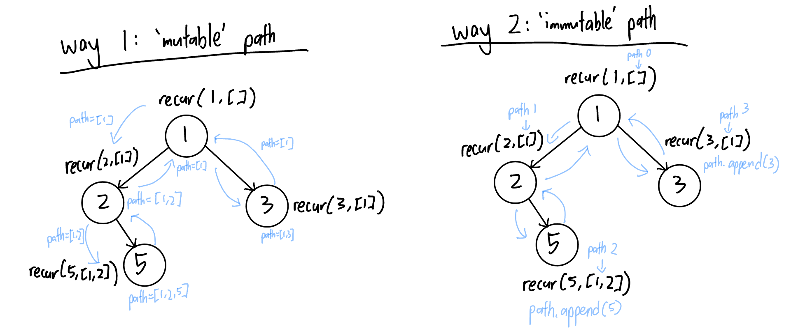

# 110. Balanced Binary Tree
### way 1: recursive approach 
Way 1 is less efficient as we will apply the `get_height` to visited node again.\
Time complexity: O(n<sup>2</sup>)\
Space complexity: O(log n)
```PYTHON
def isBalanced(self, root: Optional[TreeNode]) -> bool:
    def get_height(curr):
        if not curr:
            return 0
        return 1 + max(get_height(curr.left), get_height(curr.right))

    if not root:
        return True
    
    if abs(get_height(root.left) - get_height(root.right)) > 1:
        return False
    
    return self.isBalanced(root.left) and self.isBalanced(root.right)
```
### way 2: recursive approach
Way 2 is more efficient compared to way 1 since we just return -1 once we have found unbalanced subtree.\
Time complexity: O(n)\
Space complexity: O(log n)
```PYTHON
def isBalanced(self, root: Optional[TreeNode]) -> bool:
    def get_height(curr):
        if not curr:
            return 0

        left_height = get_height(curr.left)
        right_height = get_height(curr.right)

        if left_height == -1 or right_height == -1:
            # a tree is unbalanced if either of its subtree is unbalanced
            return -1

        if abs(left_height - right_height) > 1:
            # found unbalanced tree
            return -1

        # get height of curr node
        return 1 + max(left_height, right_height)

    return True if get_height(root) != -1 else False
```
# 257. Binary Tree Paths
   
### way 1: as our input to next level is a 'mutable' path, we need to `path.pop()` when backtracking
```PYTHON
def binaryTreePaths(self, root: Optional[TreeNode]) -> List[str]:
    def recur(curr, path):
        path.append(str(curr.val))

        if not (curr.left or curr.right):
            res_list.append("->".join(path))
            return
        
        if curr.left:
            recur(curr.left, path)
            path.pop()

        if curr.right:  
            recur(curr.right, path)
            path.pop()

    res_list = []
    recur(root, [])
    return res_list
```
### way 2: as our input to next level is a new path, so we don't need to do  anything when backtracking
```PYTHON
def binaryTreePaths(self, root: Optional[TreeNode]) -> List[str]:
    def recur(curr, path):
        if not (curr.left or curr.right):
            path.append(str(curr.val))
            res_list.append("->".join(path))
            return
        
        if curr.left:
            recur(curr.left, path + [str(curr.val)]) 

        if curr.right:
            recur(curr.right, path + [str(curr.val)]) 

        
    res_list = []
    recur(root, [])
    return res_list
```
# 404. Sum of Left Leaves
```PYTHON
def sumOfLeftLeaves(self, root: Optional[TreeNode]) -> int:
    def recur(curr):
        if not curr:
            return 0
        if curr.left and not curr.left.left and not curr.left.right:
            return curr.left.val + recur(curr.right)

        return recur(curr.left) + recur(curr.right)
    
    return recur(root)
```

