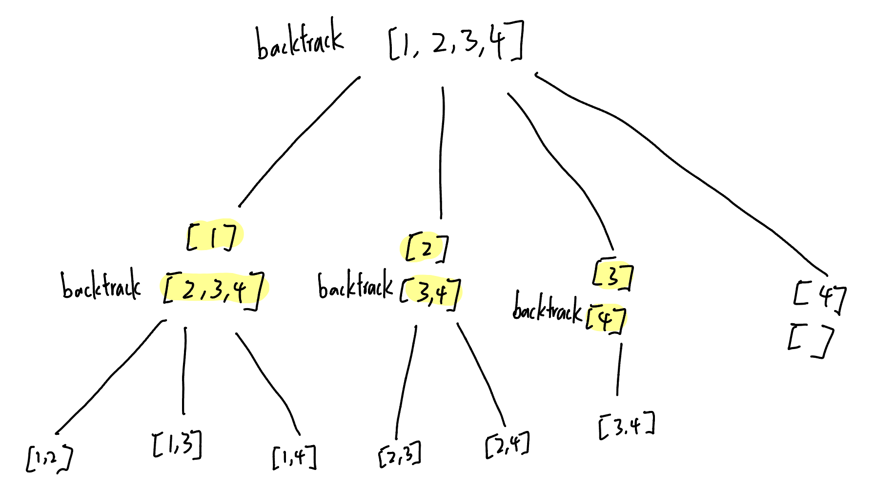
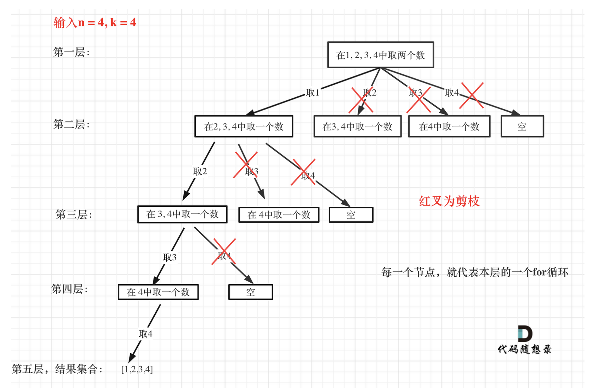

# 77. Combinations
We use `startIndex` to decide the next available range for backtracking.

### way 1: backtracking without prunning 
```PYTHON
def combine(self, n: int, k: int) -> List[List[int]]:
    def backtrack(startIndex, n, k, path):
        if len(path) == k:
            res_list.append(path[:])
            return

        for i in range(startIndex, n+1):
            path.append(i)
            backtrack(i + 1, n, k, path)
            path.pop()

    res_list = []
    backtrack(1, n, k, [])
    return res_list
```
### way 2: backtracking with prunning
  
```PYTHON
def combine(self, n: int, k: int) -> List[List[int]]:
    def backtrack(start, n, k, path):
        if len(path) == k:
            res_list.append(path[:])
            return

        # n = 4, k = 2
        # last_start should be 3
        last_start = n - (k - len(path)) + 1
        for i in range(start, last_start + 1):
            
            path.append(i)
            backtrack(i + 1, n, k, path)
            path.pop()

    res_list = []
    backtrack(1, n, k, [])
    return res_list
```