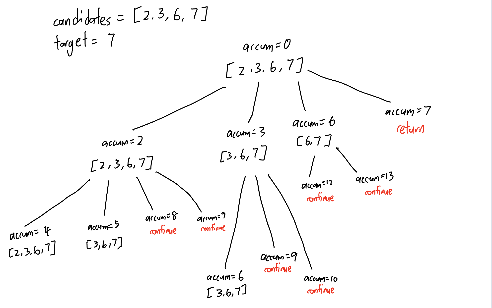
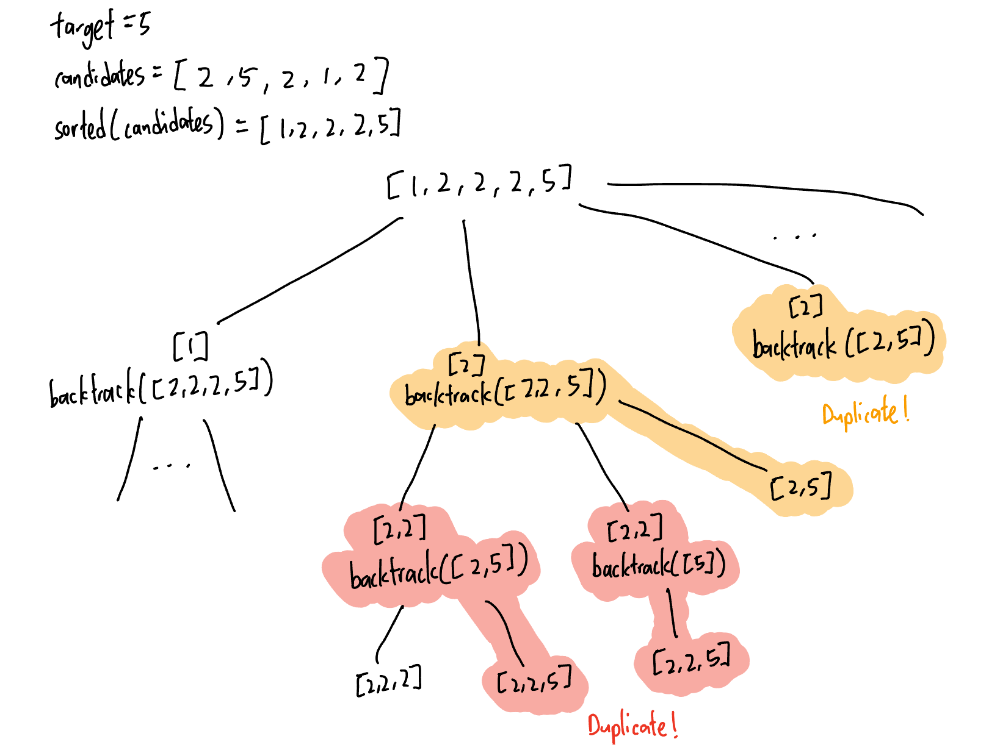
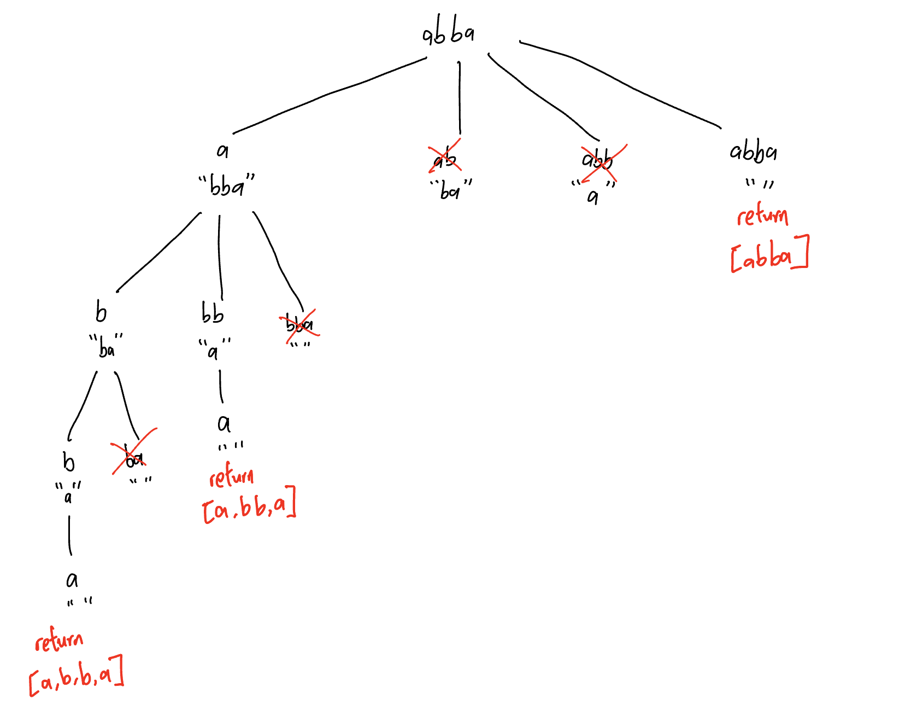

# 39. Combination Sum
  
```PYTHON
def combinationSum(self, candidates: List[int], target: int) -> List[List[int]]:
    def backtrack(accum, target, path, startIndex):
        if accum == target:
            res_list.append(path[:])
            return
        
        for i in range(startIndex, len(candidates)):
            if accum + candidates[i] > target:
                continue
            
            accum += candidates[i]
            path.append(candidates[i])
            # startIndex for next recursion is i instead of i + 1
            # since "The same number may be chosen from candidates an unlimited number of times."
            backtrack(accum, target, path, i)
            path.pop()
            accum -= candidates[i]


    res_list = []
    backtrack(0, target, [], 0)
    return res_list
```
# 40. Combination Sum II
For this question, we remove duplicates in branch level by using `startIndex`.
We must also remove duplicates in tree layer. There are two ways to remove duplicates: \
(1) with an extra array `used` to record the element we used in constructing the path\
(2) just check `if candidates[i] in candidates[startIndex:i]`


### way 1:
```PYTHON
def combinationSum2(self, candidates: List[int], target: int) -> List[List[int]]:
    def backtrack(accum, target, path, startIndex, candidates, used):
        if accum == target:
            res_list.append(path[:])
            return

        for i in range(startIndex, len(candidates)):
            if i > 0 and candidates[i] == candidates[i-1] and used[i-1] == False:
                continue

            if accum + candidates[i] > target:
                continue

            accum += candidates[i]
            path.append(candidates[i])
            used[i] = True
            backtrack(accum, target, path, i + 1, candidates, used)
            used[i] = False
            path.pop()
            accum -= candidates[i]
            

    res_list = []
    used = [False] * len(candidates)
    backtrack(0, target, [], 0, sorted(candidates), used)
    return res_list
```
### way 2: 
```PYTHON
def combinationSum2(self, candidates: List[int], target: int) -> List[List[int]]:
    def backtrack(accum, target, path, startIndex, candidates):
        if accum == target:
            res_list.append(path[:])
            return

        for i in range(startIndex, len(candidates)):
            ''' way 2'''
            if candidates[i] in candidates[startIndex:i]:
                continue
            
            ''' or way 3
            if (i > startIndex and candidates[i] == candidates[i - 1]):
                continue
            '''

            if accum + candidates[i] > target:
                continue

            accum += candidates[i]
            path.append(candidates[i])
            backtrack(accum, target, path, i + 1, candidates)
            path.pop()
            accum -= candidates[i]

    res_list = []
    backtrack(0, target, [], 0, sorted(candidates))
    return res_list
```

# 131. Palindrome Partitioning
  
### way 1: backtracking with startIndex
For backtracking in problem involved partition, the way to handle `startIndex` is different from backtracking in problem involved combination. We still loop from `startIndex` to `len(candidates)`, but we take subarray from `startIndex` to `i` instead of only take one element at `i`:
```PYTHON
# backtracking in problem involved combination
for i in range(startIndex, len(candidates)):
    node_to_process = candidates[i]

# backtracking in problem involved partition
for i in range(startIndex, len(candidates)):
    node_to_process = candidates[startIndex:i+1]
```
Full solution for 131:
```PYTHON
def partition(self, s: str) -> List[List[str]]:
    def isPalindrome(string):
        left = 0
        right = len(string) - 1
        while left <= right:
            if string[left] != string[right]:
                return False
            left += 1
            right -= 1

        return True

    def backtrack(path, s, startIndex):
        if startIndex >= len(s):
            res_list.append(path[:])
            return

        for i in range(startIndex, len(s)):
            substring = s[startIndex:i+1]

            if not isPalindrome(substring):
                continue
            
            path.append(substring)
            backtrack(path, s, i + 1)
            path.pop()

    
    res_list = []
    backtrack([], s, 0)
    return res_list
```
### way 2: backtracking with smaller string
```PYTHON
def partition(self, s: str) -> List[List[str]]:
    def isPalindrome(string):
        left = 0
        right = len(string) - 1
        while left <= right:
            if string[left] != string[right]:
                return False
            left += 1
            right -= 1

        return True

    def backtrack(path, s):
        if not s:
            res_list.append(path[:])
            return

        for i in range(1,len(s)+1):
            substring = s[:i]

            if not isPalindrome(substring):
                continue
            
            path.append(substring)
            backtrack(path, s[i:])
            path.pop()

    
    res_list = []
    backtrack([], s)
    return res_list
```
