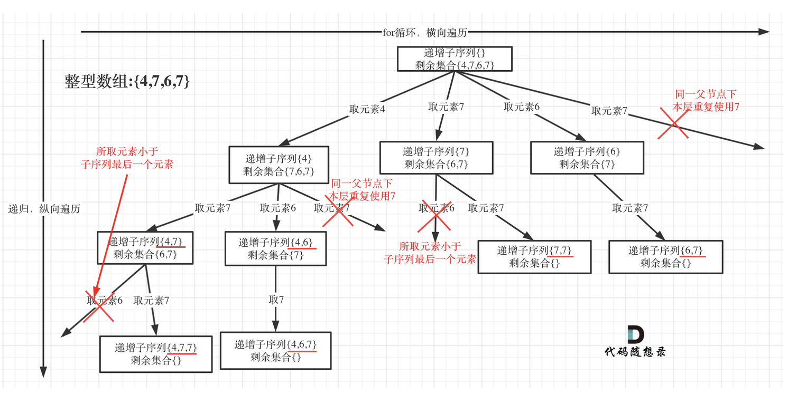

# 491. Non-decreasing Subsequences

```PYTHON
def findSubsequences(self, nums: List[int]) -> List[List[int]]:
    def backtrack(startIndex, path, nums):
        if startIndex > len(nums):
            return
            
        if len(path) >= 2:
            res_list.append(path[:])

        '''way 2:
        used = set()
        '''
        for i in range(startIndex, len(nums)):
        
            if path and path[-1] > nums[i]:
                continue

            '''way 1: '''
            if nums[i] in nums[startIndex:i]:
                continue

            ''' way 2:
            if nums[i] in used:
                    continue

            used.add(nums[i])
            '''

            path.append(nums[i])
            backtrack(i+1, path, nums)
            path.pop()

    res_list = []
    backtrack(0, [], nums)
    return res_list
```

# 46. Permutations
### way 1: with an extra array `used`
```PYTHON
def permute(self, nums: List[int]) -> List[List[int]]:
    def backtrack(nums, path, used):
        if all(used):
            res_list.append(path[:])
            return
        
        for i in range(len(nums)):
            if used[i] == True:
                continue

            used[i] = True
            path.append(nums[i])
            backtrack(nums, path, used)
            path.pop()
            used[i] = False

    res_list = []
    backtrack(nums, [], [False] * len(nums))
    return res_list
```
### way 2: without any extra array
```PYTHON
def permute(self, nums: List[int]) -> List[List[int]]:
    def backtrack(path, unused, used):
        if len(unused) == 0:
            res_list.append(path[:])

        for i in range(len(unused)):
            val = unused[i]

            used.append(val)
            path.append(val)
            unused.remove(val)

            backtrack(path, unused, used)
            
            unused.insert(i, val)
            path.pop()
            used.pop()

    res_list = []
    backtrack([], nums, [])
    return res_list
```

# 47. Permutations II
### way 1: `used` set to remove duplicate in tree layer and `.count()` to remove extra in branch level
```PYTHON
def permuteUnique(self, nums: List[int]) -> List[List[int]]:
    def backtrack(nums, path):
        if len(path) == len(nums):
            res_list.append(path[:])
            return
        
        used = set()
        for i in range(len(nums)):
            if nums[i] in used:
                continue

            if path.count(nums[i]) == nums.count(nums[i]):
                continue
            
            used.add(nums[i])
            path.append(nums[i])
            backtrack(nums, path)
            path.pop()
            

    res_list = []
    backtrack(nums, [])
    return res_list
```
### way 2: `used[i-1] == False` represent duplicates in tree layer and `used[i] == true` represent extra in branch layer
```PYTHON
def permuteUnique(self, nums: List[int]) -> List[List[int]]:
    def backtrack(nums, path, used):
        if len(path) == len(nums):
            res_list.append(path[:])
            return
        
        for i in range(len(nums)):
            if i > 0 and nums[i] == nums[i-1] and used[i-1] == False:
                continue
            
            if used[i] == True:
                continue
                
            used[i] = True
            path.append(nums[i])
            backtrack(nums, path, used)
            used[i] = False
            path.pop()
            

    res_list = []
    used = [False] * len(nums)
    backtrack(sorted(nums), [], used)
    return res_list
```