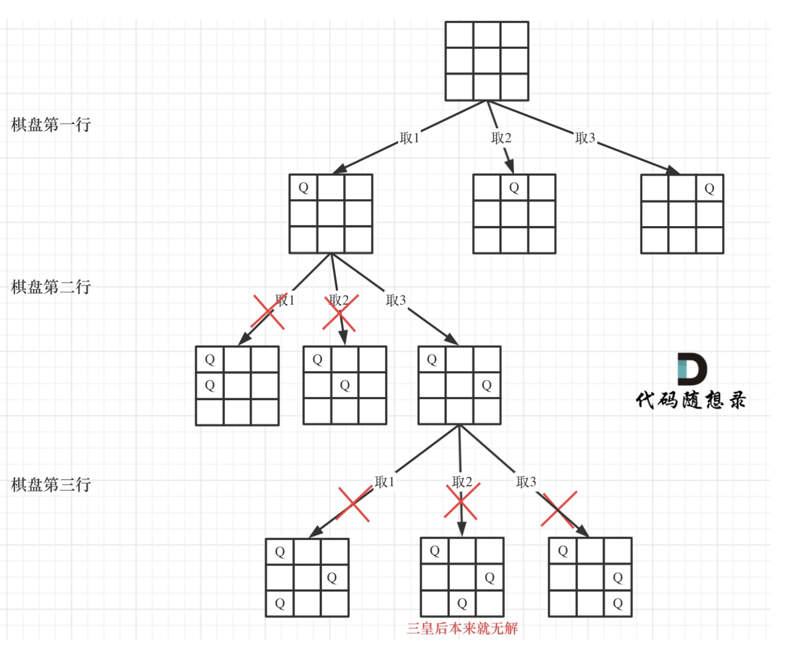

# 332. Reconstruct Itinerary
### version 1
```PYTHON
def findItinerary(self, tickets: List[List[str]]) -> List[str]:
    def get_index_to_insert_city(city_list, cityA):
        '''get a list of cities, return index to insert city A where the resulted list with in lexical order'''

        for i in range(len(city_list)):
            city_i = city_list[i]
            
            counter = 0
            while counter < 3 and cityA[counter] == city_i[counter]:
                counter += 1
            
            if counter < 3 and cityA[counter] < city_i[counter]:
                return i
            
        return len(city_list)

    def backtrack(from_to_dict, start, path):
        if len(from_to_dict) == 0:
            return path[:]

        if start not in from_to_dict.keys():
            return
        
        for i in range(len(from_to_dict[start])):
            airport = from_to_dict[start][i]

            # process tree node for next layer
            path.append(airport)
            from_to_dict[start].remove(airport)
            if len(from_to_dict[start]) == 0:
                from_to_dict.pop(start)

            # backtracking
            result = backtrack(from_to_dict, airport, path)
            if result:
                # terminate the backtracking once we found a path
                return result
            
            # revert tree node for next iteration in same layer
            if start in from_to_dict.keys():
                from_to_dict[start].insert(i, airport)
            else:
                from_to_dict[start] = [airport]
            path.pop()

    # loop through tickets to form from_to_dict 
    # where start_city as key and [list_of_end_cities] as value
    # [list_of_end_cities] is sorted in lexical order 
    from_to_dict = {}
    for [from_i,to_i] in tickets:
        if from_i in from_to_dict.keys():
            i = get_index_to_insert_city(from_to_dict[from_i], to_i)
            from_to_dict[from_i].insert(i, to_i)

        else:
            from_to_dict[from_i] = [to_i]

    return backtrack(from_to_dict, 'JFK', ['JFK'])
```
### version 2: 
```PYTHON
def findItinerary(self, tickets: List[List[str]]) -> List[str]:
    def backtrack(from_to_dict, start, path):
        if len(path) == len(tickets) + 1:
            return path
        
        if start not in from_to_dict.keys():
            return

        for _ in from_to_dict[start]:
            end = from_to_dict[start].pop(0)
            path.append(end)
            
            result = backtrack(from_to_dict, end, path)
            if result:
                return result
            
            from_to_dict[start].append(end)
            path.pop()

    # loop through tickets to form from_to_dict 
    # where start_city as key and [list_of_end_cities] as value
    from_to_dict = {}
    for [from_i,to_i] in tickets:
        if from_i in from_to_dict.keys():
            from_to_dict[from_i].append(to_i)
        else:
            from_to_dict[from_i] = [to_i]

    # sort [list_of_end_cities] in lexical order by using Python's default sort
    for key in from_to_dict.keys():
        from_to_dict[key].sort()

    return backtrack(from_to_dict, 'JFK', ['JFK'])
```

# 51. N-Queens
We use backtracking algorithm to fill the queen column by column. For each column, we try to fill the queen in different row and prune the branch if there is an attack.


From below figure, we can see that the coordinates of blocks in diagonal line have some patterns. We utilise this pattern to make sure no two queens attack each other diagonally.

```PYTHON
def solveNQueens(self, n: int) -> List[List[str]]:
    def fill_queen(board, row, col):
        '''get n*n board, row, column 
        return the resulted board where queen placed at (row,col) of the board'''
        n = len(board)

        for i in range(n):
            for j in range(n):
                if i == row and j == col:
                    board[row][col] = "Q"
                elif (i == row or j == col) and not board[i][j]:
                    board[i][j] = "."
                elif abs(row - i) == abs(col - j) and not board[i][j]:
                    board[i][j] = "."
        
        return board

    def backtrack(board,k):
        if k == n:
            res_list.append(["".join(row) for row in board])
            return

        for i in range(n):
            if board[i][k]:
                continue

            next_board = [row[:] for row in board]
            backtrack(fill_queen(next_board, i, k), k + 1)

    board = [[None] * n for _ in range(n)]
    res_list = []
    backtrack(board, 0)
    return res_list
```
TODO：For 51. N-Queens problem, try to write a function `is_valid()` in O(n). The function gets a chessboard, row_number and column_number and return `True` if placing a queen at (row, column) of chessboard would not lead to an attack, otherwise return `False`.

TODO: Question 37. Sudoku Solver
