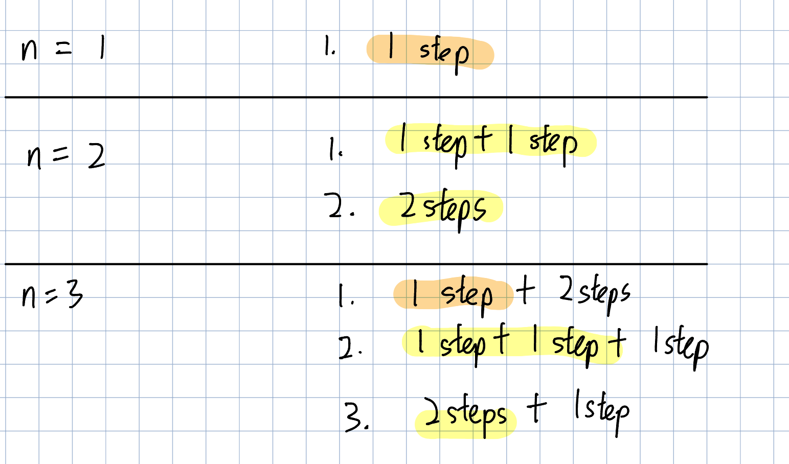
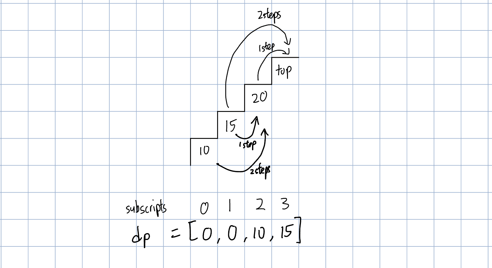

# 509. Fibonacci Number
### way 1: dynamic programming in top-down recursive approach 
Time complexity: O(n), each fib number is calculated once\
Space complexity: O(2n), 1n for the `memo` array and another 1n for call stack which is used implicitly duing recusion
```PYTHON
def fib(self, n: int) -> int:
    def recur(n):
        nonlocal memo
        if n < len(memo):
            return memo[n]
        
        result = recur(n - 1) + recur(n - 2)
        # memoization
        memo.insert(n, result)

        return result

    memo = [0, 1]

    return recur(n)
```

### way 2: dynamic programming in bottom-up iterative approach 
```PYTHON
def fib(self, n: int) -> int:
    if n <= 1: return n
    
    memo = [None] * (n+1)
    memo[0] = 0
    memo[1] = 1

    for i in range(2, n+1):
        memo[i] = memo[i-1] + memo[i-2]

    return memo[n]
```

# 70. Climbing Stairs
### way 1: dynamic programming
Each time we can only climb 1 or 2 steps. Hence, to climb to 3rd floor, we can climb 2 steps from 1st floor or 1 step from 2nd floor.

(1) Determine the `dp` array and the meaning of its subscripts
- `dp[i]` = the number of ways to reach `i`th floor

(2) Determine the recurrence formula
- `dp[i] = dp[i - 1] + dp[i - 2]`

(3) The initialisation of the `dp` array
- `dp[1] = 1` , `dp[2] = 2`

(4) Determine the traversal order
- As `dp[i]` depends on `dp[i - 1]` and `dp[i - 2]`, so we should traverse in ascending order from `0` to `n`

(5) Derive the resulted `dp` array and check it by printing
- For example, when `n = 7`, the `dp` should be `[1, 2, 3, 5, 8, 13, 21].

```PYTHON
def climbStairs(self, n: int) -> int:
    if n <= 2: return n

    dp = [-1] * (n + 1)
    dp[1] = 1
    dp[2] = 2
    for i in range(3, n + 1):
        dp[i] = dp[i-1] + dp[i-2]

    return dp[n]
```

# 746. Min Cost Climbing Stairs
### way 1: dynamic programming
Each time we can only climb 1 or 2 steps. Hence, in order to climb to top floor, we can either climb 2 steps from `top - 2` floor or 1 step from `top - 1`.

(1) Determine the `dp` array and the meaning of its subscripts
- `dp[i]` = the minimum of cost to reach `i`th floor

(2) Determine the recurrence formula
- `dp[i] = min((dp[i - 2] + cost[i - 2]) + (dp[i - 1] + cost[i - 1]))`

(3) The initialisation of the `dp` array
- `dp[0] = 0` , `dp[1] = 0`

(4) Determine the traversal order
- As `dp[i]` depends on `dp[i - 1]` and `dp[i - 2]`, so we should traverse in ascending order from `0` to `n`

(5) Derive the resulted `dp` array and check it by printing
- For example, when `cost = [10,15,20]`, the `dp` should be `[0, 0, 10, 15]`.



Time complexity: O(n)\
Space complexity: O(n)
```PYTHON
def minCostClimbingStairs(self, cost: List[int]) -> int:
    dp = [0] * (len(cost) + 1)
    for i in range(2, len(dp)):
        dp[i] = min(cost[i - 1] + dp[i - 1], cost[i - 2]+ dp[i - 2]) 

    return dp[-1]
```