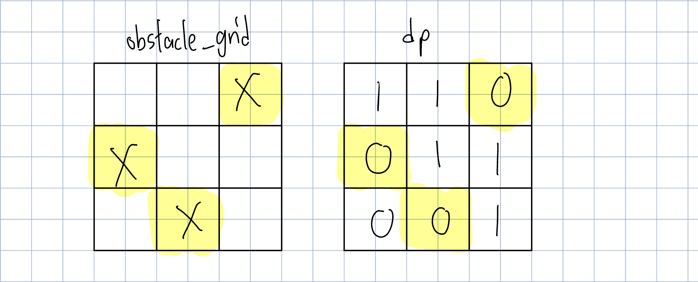

# 62. Unique Paths
### way 1: dynamic programming
The robot can only move either down or right at any point in time.

(1) Determine the `dp` array and the meaning of its subscripts
- `dp[i][j]` = the number of ways to reach `grid[i][j]` from `grid[0][0 ]`

(2) Determine the recurrence formula
- `dp[i][j] = dp[i-1][j] + dp[i][j-1]`

(3) The initialisation of the `dp` array
- `dp[0][0] = 1` 

(4) Determine the traversal order
- As the robot tries to move from the top-left corner (i.e., `grid[0][0]`) to the bottom-right corner (i.e., `grid[m - 1][n - 1]`), so we traverse from 0 to m (for row) and from 0 to n (for column).

(5) Derive the resulted `dp` array and check it by printing
- For example, when `m = 3, n = 2`, the `dp` should be `[[1, 1],[1,2],[1,3]]`.


Time complexity: O(m * n)\
Space complexity: O(m * n)
```PYTHON
def uniquePaths(self, m: int, n: int) -> int:
    dp = []
    
    # fill first row of dp with 1
    dp.append([1] * n)

    # fill first col of dp with 1
    for i in range(1,m):
        row = [1] + [0] * (n - 1)
        dp.append(row)

    for i in range(1, m):
        for j in range(1, n):
            dp[i][j] = dp[i-1][j] + dp[i][j-1]

    return dp[m-1][n-1]
```

63. Unique Paths II
### way 1: dynamic programming
The robot can only move either down or right at any point in time and its path to destination cannot include any square that is an obstacle.

(1) Determine the `dp` array and the meaning of its subscripts
- `dp[i][j]` = the number of ways to reach `grid[i][j]` from `grid[0][0]`

(2) Determine the recurrence formula
- `dp[i][j] = dp[i-1][j] + dp[i][j-1]` if `grid[i][j]` does not have obstacle

(3) The initialisation of the `dp` array
- `dp[0][0] = 1` 
- for the first row of dp, only fill the square if `grid[0][column]` does not have obstacle and `grid[0][column - 1] == 1` 
- for the first column of dp, only fill the square if `grid[row][0]` does not have obstacle and `grid[0][col - 1] == 1` 

(4) Determine the traversal order
- As the robot tries to move from the top-left corner (i.e., `grid[0][0]`) to the bottom-right corner (i.e., `grid[m - 1][n - 1]`), so we traverse from 1 to `no_row-1` and from 0 to `no_col-1`.

(5) Derive the resulted `dp` array and check it by printing
- For example, when `obstacleGrid = [[0,0,1],[1,0,0],[0,1,0]]`, the `dp` should be `[[1, 1, 0], [0, 1, 1], [0, 0, 1]]`.


Time complexity: O(no_row * no_col)\
Space complexity: O(no_row * no_col)
```PYTHON
def uniquePathsWithObstacles(self, obstacleGrid: List[List[int]]) -> int:
    if obstacleGrid[0][0] == 1: return 0

    no_row = len(obstacleGrid)
    no_col = len(obstacleGrid[0])
    dp = [[0] * no_col for _ in range(no_row) ]
    # fill the first row
    dp[0][0] = 1
    for j in range(1, no_col):
        if dp[0][j - 1] == 0 or obstacleGrid[0][j] == 1:
            dp[0][j] = 0
        else:
            dp[0][j] = 1
    
    # fill the first column
    for i in range(1, no_row):
        if dp[i-1][0] == 0 or obstacleGrid[i][0] == 1:
            dp[i][0] = 0
        else:
            dp[i][0] = 1
            
    for i in range(1, no_row):
        for j in range(1, no_col):
            if obstacleGrid[i][j] == 1:
                dp[i][j] = 0
            else:
                dp[i][j] = dp[i-1][j] + dp[i][j-1]

    return dp[-1][-1]
```