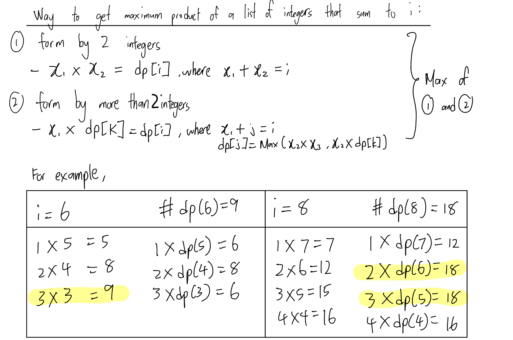
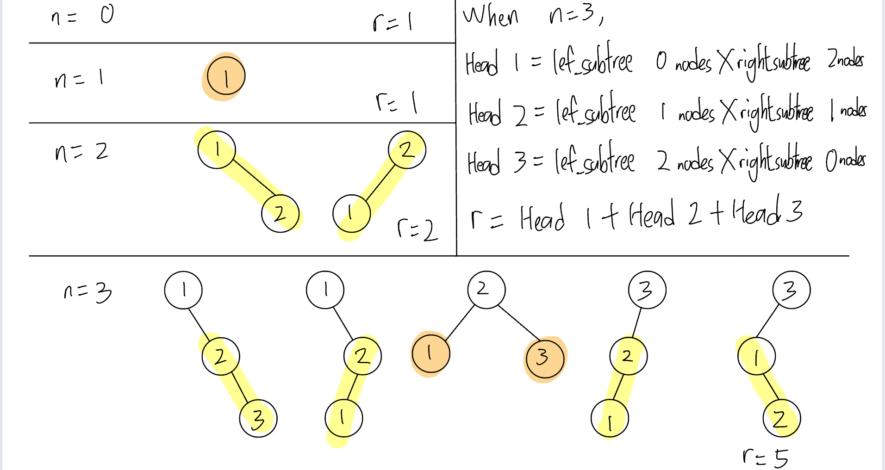

# 343. Integer Break
### way 1: dynamic programming
(1) Determine the `dp` array and the meaning of its subscripts
- `dp[i]` = the maximum product of a list of intergers where the sum of the list of integers = `i`

(2) Determine the recurrence formula
- `dp[i] = max([max(dp[i-j]*j,(i-j) * j ) for j in range(1, i//2 + 1)])`



(3) The initialisation of the `dp` array
- `dp[0] = 0, dp[1] = 0, dp[2] = 1` 

(4) Determine the traversal order
- As `dp[i]` depends on `dp[i - j]`, so we loop from 0 to i.

(5) Derive the resulted `dp` array and check it by printing
- For example, when `n = 8`, the `dp` should be `[0, 0, 1, 2, 4, 6, 9, 12, 18]`.

Time complexity: O(n<sup>2</sup>)
Space complexity: O(n)
```PYTHON
def integerBreak(self, n: int) -> int:
    # initialisation of dp array
    dp = [0] * (n + 1)
    dp[2] = 1

    for i in range(3, n + 1):
        for j in range(1, i//2 + 1):
            dp[i] = max(dp[i-j]*j, (i - j)*j, dp[i])

    return dp[n]
```
### way 2: dp
```PYTHON
def integerBreak(self, n: int) -> int:
    dp = [0] * (n+1)

    for index in range(2, n+1):
        # find maximum product that sum to index
        for num1 in range(1,index//2+1):
            num2 = index - num1
            dp[index] = max(dp[index],num2*dp[num1], num1*dp[num2], num1*num2)

    return dp[n]
```

# 96. Unique Binary Search Trees
### way 1: dynamic programming
(1) Determine the `dp` array and the meaning of its subscripts
- `dp[i]` = the number of structurally unique BST's (binary search trees) which has exactly n nodes of unique values from 1 to n

(2) Determine the recurrence formula
- `dp[i] = sum([dp[j - 1] * dp[i - j] for j in range(1, i + 1)])`


(3) The initialisation of the `dp` array
- `dp[0] = 1` 

(4) Determine the traversal order
- As `dp[i]` depends on `dp[i - j]`, so we loop from 1 to `i + 1`.

(5) Derive the resulted `dp` array and check it by printing
- For example, when `n = 3`, the `dp` should be `[1, 1, 2, 5]`.

Time complexity: O(n<sup>2</sup>)
Space complexity: O(n)
```PYTHON
def numTrees(self, n: int) -> int:
    dp = [0] * (n + 1)
    dp[0] = 1
    for maxVal in range(1, n+1):
        for rootVal in range(1,maxVal+1):
            noNodeLeftSubtree = rootVal - 1
            noNodeRightSubtree = maxVal - rootVal
            dp[maxVal] += (dp[noNodeLeftSubtree] * dp[noNodeRightSubtree])
    
    return dp[n]
```

# Reference
[Programmer Carl - 96.Unique Binary Search Trees](https://programmercarl.com/0096.%E4%B8%8D%E5%90%8C%E7%9A%84%E4%BA%8C%E5%8F%89%E6%90%9C%E7%B4%A2%E6%A0%91.html#%E6%80%9D%E8%B7%AF)
