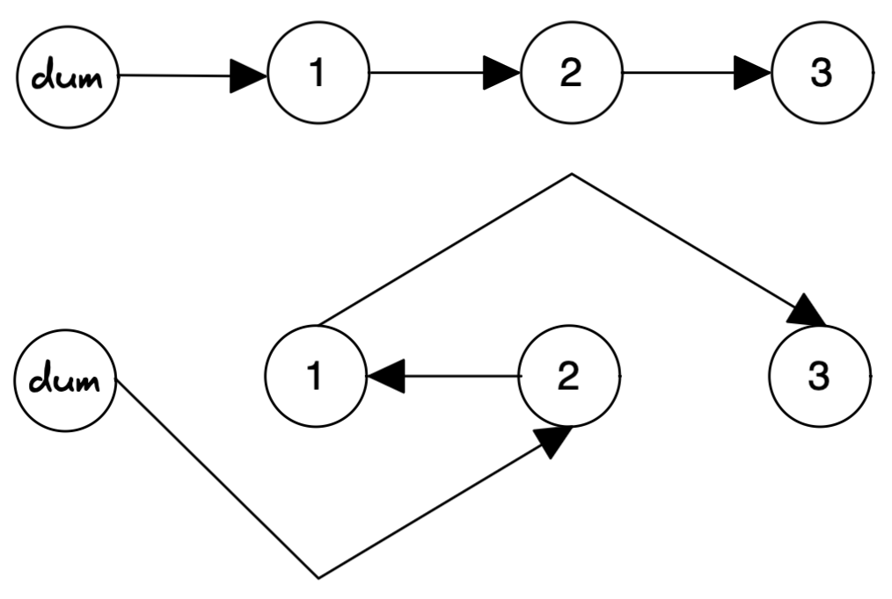
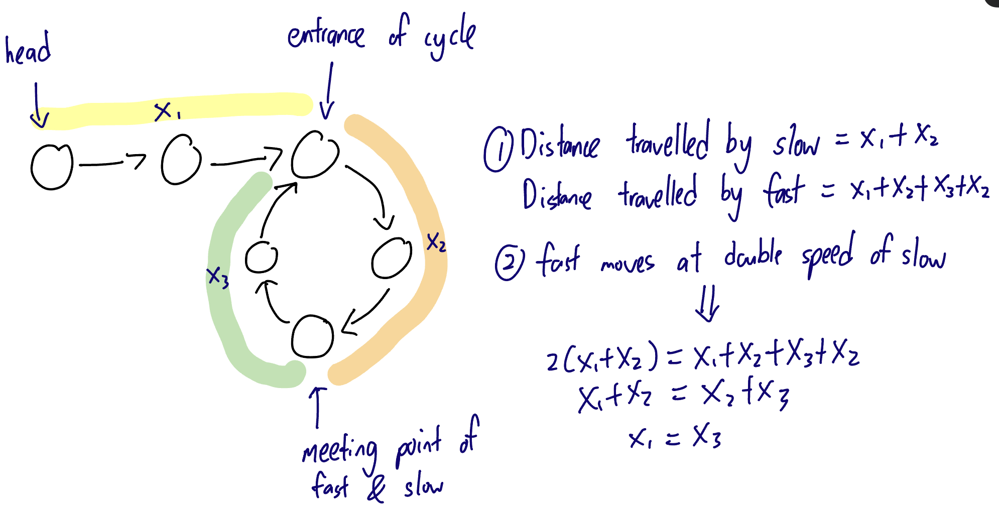

# 24. Swap Nodes in Pairs
For this question, it is necessary to draw a diagram before coding. Without a diagram, keeping track of the multiple pointers and the proper order in which they should be manipulated can be challenging. 
 
To swap nodes in pairs, we need to change three pointers. To keep track of these three pointers, we must store the pointer before exchange. When we prepare for the next iteration, we must set `prev` to `first` instead of `second`

We also declared a `dummyHead` so that we don't need two separate while-loops to handle the head node and non-head node, respectively.\

Time compleity: O(n)\
Space complexity: O(1)
```PYTHON
def swapPairs(self, head: Optional[ListNode]) -> Optional[ListNode]:
        dummyHead = ListNode(val = -1, next = head)

        prev = dummyHead
        while(prev.next and prev.next.next):
            # store the pointer before exchange
            first = prev.next
            second = first.next
            third = second.next

            # exchange the pointer
            prev.next = second
            second.next = first
            first.next = third

            # prepare for next iteration
            prev = first
            
        return dummyHead.next

```
# 19. Remove Nth Node From End of List
There are two ways to solve this question: (1) reverse, delete, reverse and (2) slow and fast pointers.

For the way (2), we uses two pointers, `fast` and `slow`, both initialized to the dummy head. We move the `fast` pointer first while reducing `n`. When `n == 0`, the `slow` pointer starts moving so that the `fast` pointer will be n+1  steps ahead of the `slow` pointer. From this onward (n < 1), we keep reducing n and moving both pointers at the same time. Eventually, the `fast` will point to the last node of the linked list, whereas the `slow` will point to the node just before the node to be removed.
  
### way 1: reverse, delete, reverse
time complexity: O(3n)\
space complexity: O(n)
```PYTHON
def removeNthFromEnd(self, head: Optional[ListNode], n: int) -> Optional[ListNode]:
    def reverse(curr,pre):
        if (not curr):
            return pre
        
        temp = curr.next
        curr.next = pre

        return reverse(temp,curr)

    # first reverse 
    reverse_linked_list = reverse(head, None)

    # now the end of list bcomes the start of list
    # delete the node as usual
    dummyHead = ListNode(val = -1, next = reverse_linked_list)

    prev = dummyHead
    while(n > 1):
        prev = prev.next
        n -= 1

    prev.next = prev.next.next

    # second reverse before return
    return reverse(dummyHead.next, None)
```
### way 2: two pointers - slow & fast
time complexity: O(n)\
space complexity: O(1)
```PYTHON
def removeNthFromEnd(self, head: Optional[ListNode], n: int) -> Optional[ListNode]:
    dummyHead = ListNode(val = -1, next = head)

    fast = dummyHead
    slow = fast
    while(fast.next):
        if (n < 1):
            slow = slow.next

        fast = fast.next
        n -= 1
    
    slow.next = slow.next.next

    return dummyHead.next
```

# 160. Intersection of Two Linked Lists
### way 1:
Store all the elements of linked list `A` in `memo` set. Loop through the linked list `B` and check for the first match and then return it.

time complexity: O(m+n), where m = size of linked list `A` and n = size of `B`\
space complexity: O(m)
```PYTHON
def getIntersectionNode(self, headA: ListNode, headB: ListNode) -> Optional[ListNode]:

        memo = set()
        currA = headA
        while(currA):                       # loop through linked list A
            memo.add(currA)
            currA = currA.next

        currB = headB
        while(currB):                       # loop through linked list B
            if (currB in memo):
                return currB
            
            currB = currB.next

        return None
```
### way 2: 
Get the size of the linked list `A` and `B`. Then, we use the size difference `diff` to align the pointer of the longer linked list, i.e. we move the pointer of the longer linked list forward by `diff` steps. After the alignment, we can traverse both linked lists at the same speed until we find the intersection or reach the terminating node (None).
  

Time complexity: O(m+n)\
Space complexity: O(1)
```PYTHON 3
def getIntersectionNode(self, headA: ListNode, headB: ListNode) -> Optional[ListNode]:
        def get_size(linked_list):
            size = 0
            curr = linked_list
            while curr:
                size += 1
                curr = curr.next
            
            return size

        sizeA = get_size(headA)
        sizeB = get_size(headB)
        startA = headA
        startB = headB

        # align pointer of longer linked list
        if sizeA > sizeB:
            diff = sizeA - sizeB
            while(diff > 0):
                startA = startA.next
                diff -= 1
        else:
            diff = sizeB - sizeA
            while(diff > 0):
                startB = startB.next
                diff -= 1

        # tranverse the linked list A & B at the same speed
        while(startA):
            if startA == startB:
                return startA
            else:
                startA = startA.next
                startB = startB.next
        
        return None
```
# 142. Linked List Cycle II
Core idea:\
(1) check if there is a cycle\
(2) find the entrance of cycle

To check if there is a cycle, we can use `fast` and `slow` pointers. Since `fast` pointer moves at double speed of `slow` pointer, they will intersect if and only if there is a cycle, else the `fast` pointer will reach the terminating node (aka Floyd cycle algorithm).

To find the entrance of cycle, we need to perform a bit of mathematics. 
  
Since `x1 = x3`, if we move from the head and the meeting point at the same speed, both pointers will meet at the entrance of loop at the same time.

Time complexity: O(n)
Space complexity: O(1)
```PYTHON
def detectCycle(self, head: Optional[ListNode]) -> Optional[ListNode]:
    
    # check if there is a cycle
    slow = head
    fast = head
    
    while(fast and fast.next):
        fast = fast.next.next
        slow = slow.next
        if(fast == slow):
            # found the first intersection of fast and slow pointers
            # which means there is a cycle
            
            # to find the entrance of cycle
            curr = head
            while(curr):
                if(curr == fast):
                    return curr
                curr = curr.next
                fast = fast.next
    
    # cycle not found
    return None
```