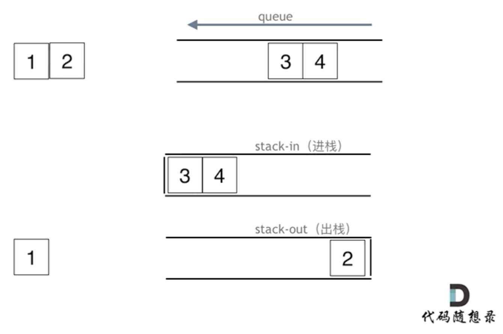

# 232. Implement Queue using Stacks
In order to implement queue by using only stack, we need at least two stacks which responsible for input and output respectively.
  
```PYTHON
class MyQueue:

    def __init__(self):
        self.in_stack = []
        self.out_stack = []

    def push(self, x: int) -> None:
        self.in_stack.append(x)

    def pop(self) -> int:
        if self.out_stack:
            return self.out_stack.pop()
        else:
            # move all the elements from in_stack to out_stack
            # so that we can get the first-in element
            while (self.in_stack):
                self.out_stack.append(self.in_stack.pop())
            return self.out_stack.pop()

    def peek(self) -> int:
        val = self.pop()
        self.out_stack.append(val)
        return val

    def empty(self) -> bool:
        return not(self.in_stack or self.out_stack) 
```

# 225. Implement Stack using Queues
### way 1: two queues
  
```PYTHON
from collections import deque
class MyStack:

    def __init__(self):
        self.queue = deque()

    def push(self, x: int) -> None:
        self.queue.append(x)
        
    def pop(self) -> int:
        # move all the elements except the last element into 
        # a temporarily deque, so that we can get the last-in element
        temp = deque()
        while(len(self.queue) > 1):
            temp.append(self.queue.popleft())

        val = self.queue.popleft()
        # reassign the temporarily deque to self.queue
        # after storing the value for output
        self.queue = temp

        return val

    def top(self) -> int:
        temp = deque()
        while(len(self.queue) > 1):
            temp.append(self.queue.popleft())

        val = self.queue.popleft()
        # add the last-in element back to the temporarily deque
        # after storing the value for output
        temp.append(val)
        self.queue = temp

        return val

    def empty(self) -> bool:
        return not (self.queue)     
```
### way 2: one queue
append (size - 1) element of the queue to the queue, then pop out the last-in element
```PYTHON
from collections import deque
class MyStack:

    def __init__(self):
        self.queue = deque()

    def push(self, x: int) -> None:
        self.queue.append(x)
        
    def pop(self) -> int:
        size = len(self.queue)
        while( size > 1):
            self.queue.append(self.queue.popleft())
            size -= 1

        return self.queue.popleft()

    def top(self) -> int:
        val = self.pop()
        self.queue.append(val)

        return val

    def empty(self) -> bool:
        return not (self.queue)
```

# Reference
[代码随想录 - 232.用栈实现队列](https://programmercarl.com/0232.%E7%94%A8%E6%A0%88%E5%AE%9E%E7%8E%B0%E9%98%9F%E5%88%97.html#%E6%80%9D%E8%B7%AF)

##### TODO: improve the image about simulation