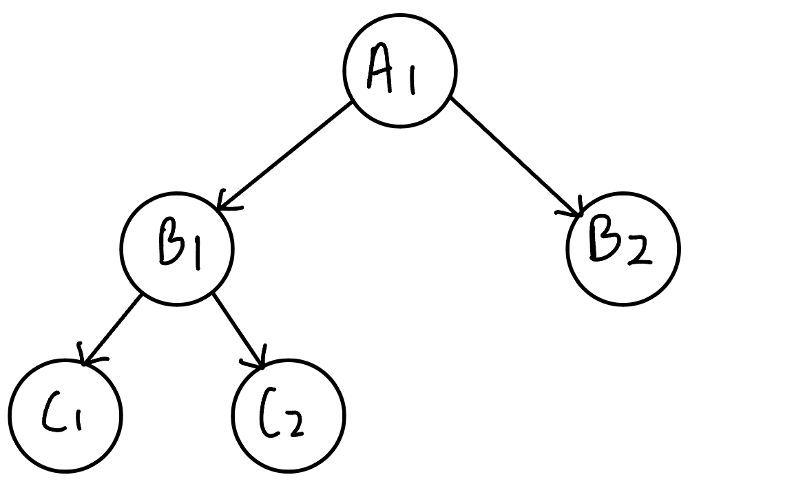
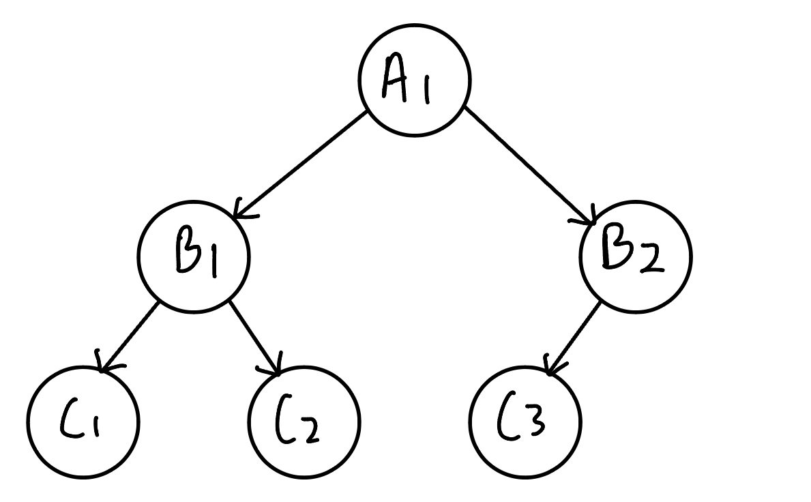
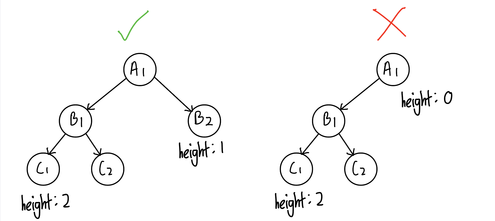
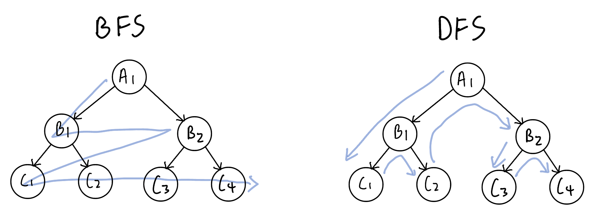

# Binary tree
Binary tree is a tree data structure where every node in a binary tree has 0 to 2 children.

There are two ways to represent binary tree in memory:\
(1) array ([see heap data stucture](./DS_Heap.md))\
(2) linked list (with `left` child node and `right` child node)

### Types of binary tree
#### Full binary tree: 
every node has 0 or 2 children.
  
#### Complete binary tree: 
All levels are completely filled except possibly the last level and all nodes in the last level are as far left as possible. 
  
#### Balanced binary tree (aka AVL tree)
For each node, the height difference of the left and right subtree of the node is not more than 1
  

### Ways to traverse a tree
####  Breadth-first search (BFS)
- visits all nodes level by level
- BFS is implemented using queue and can only be traversed in iterative approach

#### Depth-first search (DFS)
- explores each branch until reaching the leaf node then backtracking to next branch
- the traversal can be done in three types of orders:
    1. **Inorder** 
        - traverse from the **left** subtree to the **root** then to the **right** subtree
        - normally used in problem with binary search tree (see [details](#binary-search-tree))
    2. **Preorder**
        - traverse from the **root** to the **left** subtree then to the **right** subtree. 
        - normally used when we want to pass something from root node to leaf node (see [example](./Day13_bfs_binary_tree.md/#104-maximum-depth-of-binary-tree))
    3. **Post order**
        - traverse from the **left** subtree to the **right** subtree then to the **root**. 
        - normally used when we want to pass something from leaf node to root node. (see [example](./Day13_bfs_binary_tree.md/#104-maximum-depth-of-binary-tree))
        - Besides, post order traversal can be finished earlier by setting early termination case (see [example](./Day18_binary_tree.md/#way-1-recursive-approach-dfs-in-postorder-with-early-termination-case))

- DFS is implemented using stack. Hence, the traversal of tree can be done in:\
(a) recursive approach \
(b) iterative approach

  

# Binary search tree
Definition of Binary search tree:\
(1) All the nodes in left subtree < current node \
(2) All the nodes in right subtree > current node 

Due to the definition of binary search tree, inorder traverse of binary search tree will result in a sorted array which is in ascending order.

Hence, ways to solve problems involved binary search tree:\
(1) dfs in postorder with narrower valid range as inputs for next layer (see [example](./Day17_binary_tree.md/#way-2-recursive-approach-dfs-in-postorder-with-narrower-valid-range-as-input-for-next-layer)) \
(2) dfs in inorder with `pre` recording the last visited node (see [example](./Day18_binary_tree.md/#way-2-recursive-approach-dfs-in-inorder))\
(3) serialise binary search tree in inorder, then do operations on the serialised array (see [example](./Day17_binary_tree.md/#way-1-serialise-binary-search-tree-in-inorder-then-check-if-the-serialised-list-is-monotonic))

# Reference
[Breadth-First Search (BFS) and Depth-First Search (DFS) for Binary Trees in Java](https://www.digitalocean.com/community/tutorials/breadth-first-search-depth-first-search-bfs-dfs#what-is-depth-first-search-dfs)\
[代码随想录 - 二叉树](https://programmercarl.com/%E4%BA%8C%E5%8F%89%E6%A0%91%E7%90%86%E8%AE%BA%E5%9F%BA%E7%A1%80.html#%E4%BA%8C%E5%8F%89%E6%A0%91%E7%9A%84%E7%A7%8D%E7%B1%BB)