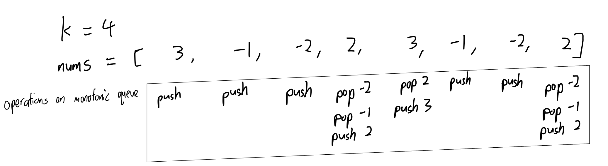

# 239. Sliding Window Maximum

### way 1: brute-force(getting max while sliding window)
Could not pass all the leetcode test case since it has high time complexity.\
Time complexity: O(n*k) 
Space complexity: O(k)
```PYTHON
def maxSlidingWindow(self, nums: List[int], k: int) -> List[int]:
    if len(nums) <= k:
        return [max(nums)]

    window = nums[:k]
    max_list = [max(window)]

    for i in range(k,len(nums)):

        window = nums[i + 1 - k : i + 1]
        max_list.append(max(window))
    
    return max_list
```

### way 2: maintain a monotonic queue which stores possible max values of sliding windows
Time complexity: O(n), since every element in the monotonic queue will only be push and pop by one time\
   
Space complexity: O(k)
```PYTHON
from collections import deque
class monotonic_queue:
    # values in queue are in descending order
    def __init__(self):
        self.queue = deque()

    def push(self,val):
        while self.queue and self.queue[-1] < val:
            # pop all the elements in the queue which smaller than the val
            self.queue.pop()
        self.queue.append(val)

    def pop(self):
        return self.queue.popleft()

    def get_max_value(self):
        # as this is a monotonic queue,
        # the front value will always be the maximum value of the queue
        return self.queue[0] if len(self.queue) > 0 else -float("inf")

class Solution:
    def maxSlidingWindow(self, nums: List[int], k: int) -> List[int]:
        if len(nums) <= k:
            return [max(nums)]
        
        queue = monotonic_queue()
        max_list = []

        # construct the sliding window by using first (k-1) elements of nums
        for i in nums[:k]:
            queue.push(i)
        max_list.append(queue.get_max_value())

        # sliding through the rest of the nums
        for start, end in enumerate(range(k, len(nums))):
            if nums[start] == queue.get_max_value():
                queue.pop()
            queue.push(nums[end])
            
            max_list.append(queue.get_max_value())
        
        return max_list
```

# 347. Top K Frequent Elements
Use hash map and heap sort\
Time complexity: O(n log k)
```PYTHON
import heapq
class Solution:
    def topKFrequent(self, nums: List[int], k: int) -> List[int]:
        # declare a dict where numbers as keys and frequency of the numbers as values
        val_freq_map = {}
        for i in nums:
            if i in val_freq_map.keys():
                val_freq_map[i] += 1
            else:
                val_freq_map[i] = 1

        # heap sort the items of val_freq_map by values
        h = []
        for key, value in val_freq_map.items():
            heapq.heappush(h, (value,key))

            if len(h) > k:
                heapq.heappop(h)

        return [key for (val,key) in h]
```