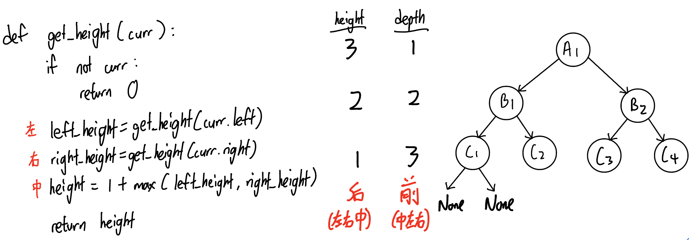

102. Binary Tree Level Order Traversal
```PYTHON
from collections import deque

def levelOrder(self, root: Optional[TreeNode]) -> List[List[int]]:
        if not root:
            return []
            
        queue = deque([root])
        res_list = []
        while(queue):
            size = len(queue)
            level_nodes = []
            for _ in range(size):
                node = queue.popleft()
                level_nodes.append(node.val)
                if node.left:
                    queue.append(node.left)
                if node.right:
                    queue.append(node.right)
            res_list.append(level_nodes)
        
        return res_list
```
# 107. Binary Tree Level Order Traversal II
```PYTHON
from collections import deque

class Solution:
    def levelOrderBottom(self, root: Optional[TreeNode]) -> List[List[int]]:
        if not root:
            return []
        
        queue = deque([root])
        res_list = []
        while (queue):
            size = len(queue)
            level_nodes = []
            while (size > 0):
                node = queue.popleft()
                level_nodes.append(node.val)
                if (node.left):
                    queue.append(node.left)
                if (node.right):
                    queue.append(node.right)
                size -= 1
            res_list.append(level_nodes)

        return res_list[::-1]
```
# 199. Binary Tree Right Side View
```PYTHON
from collections import deque
class Solution:
    def rightSideView(self, root: Optional[TreeNode]) -> List[int]:
        if not root:
            return []

        queue = deque([root])
        res_list = []
        while (queue):
            res_list.append(queue[-1].val)
            size = len(queue)
            while size > 0:
                node = queue.popleft()
                if node.left:
                    queue.append(node.left)
                if node.right:
                    queue.append(node.right)

                size -= 1
        
        return res_list
```
# 637. Average of Levels in Binary Tree
```PYTHON
from collections import deque
class Solution:
    def averageOfLevels(self, root: Optional[TreeNode]) -> List[float]:
        queue = deque([root])
        res_list = []
        while (queue):
            level_nodes = []
            size = len(queue)
            while (size > 0):
                node = queue.popleft()
                level_nodes.append(node.val)

                if node.left:
                    queue.append(node.left)
                if node.right:
                    queue.append(node.right)

                size -= 1
            average = round(sum(level_nodes)/len(level_nodes), 5)
            res_list.append(average)

        return res_list
```

# 429. N-ary Tree Level Order Traversal
```PYTHON
from collections import deque
class Solution:
    def levelOrder(self, root: 'Node') -> List[List[int]]:
        if not root:
            return []

        queue = deque([root])
        res_list = []
        while queue:
            size = len(queue)
            nodes_level = []
            while size > 0:
                node = queue.popleft()
                nodes_level.append(node.val)

                if not node.children:
                    size -= 1
                    continue
            
                for child in node.children:
                    print(child.val)
                    queue.append(child)
                
                size -= 1

            res_list.append(nodes_level)

        return res_list
```
# 515. Find Largest Value in Each Tree Row
```PYTHON
from collections import deque
class Solution:
    def largestValues(self, root: Optional[TreeNode]) -> List[int]:
        if not root:
            return []

        queue = deque([root])
        max_list = []
        while queue:
            size = len(queue)
            max_v = -float("inf")
            while size > 0:
                node = queue.popleft()

                if node.val > max_v:
                    max_v = node.val
                
                if node.left:
                    queue.append(node.left)
                if node.right:
                    queue.append(node.right)

                size -= 1
            max_list.append(max_v)
        
        return max_list
```
# 116. Populating Next Right Pointers in Each Node
```PYTHON
"""
# Definition for a Node.
class Node:
    def __init__(self, val: int = 0, left: 'Node' = None, right: 'Node' = None, next: 'Node' = None):
        self.val = val
        self.left = left
        self.right = right
        self.next = next
"""
from collections import deque
class Solution:
    def connect(self, root: 'Optional[Node]') -> 'Optional[Node]':
        if not root:
            return root

        queue = deque([root])
        while queue:
            size = len(queue)
            while size > 0:
                node = queue.popleft()

                if node.left:
                    queue.append(node.left)
                if node.right:
                    queue.append(node.right)

                if size == 1:
                    node.next = None
                else:
                    node.next = queue[0]

                size -= 1

        return root
```
# 117. Populating Next Right Pointers in Each Node II
```PYTHON
"""
# Definition for a Node.
class Node:
    def __init__(self, val: int = 0, left: 'Node' = None, right: 'Node' = None, next: 'Node' = None):
        self.val = val
        self.left = left
        self.right = right
        self.next = next
"""
from collections import deque
class Solution:
    def connect(self, root: 'Node') -> 'Node':
        if not root:
            return root

        queue = deque([root])
        while queue:
            size = len(queue)
            while size > 0:
                node = queue.popleft()

                if node.left:
                    queue.append(node.left)
                if node.right:
                    queue.append(node.right)

                if size == 1:
                    node.next = None
                else:
                    node.next = queue[0]

                size -= 1
        return root
```
# 104. Maximum Depth of Binary Tree
To get the height of a binary tree, we have to traverse the tree in post order, i.e. left, right and mid. To get get the depth of a binary tree, we have to traverse the tree in pre order, i.e. mid, left and right. As the height of the root node will equal to the max depth of a binary tree, we can still solve this question by using `get_height` function.
  
### way 1: recursive approach (dfs in post order)
```PYTHON
def maxDepth(self, root: Optional[TreeNode]) -> int:
    def get_height(curr):
        if not curr:
            return 0
        else:
            return 1 + max(get_height(curr.left), get_height(curr.right))
    
    return get_height(root)
```
### way 2: iterative approach (bfs)
```PYTHON
from collections import deque
def maxDepth(self, root: Optional[TreeNode]) -> int:
        if not root:
            return 0
        
        queue = deque([root])
        depth = 0
        while queue:
            size = len(queue)
            depth += 1     
            while size > 0:
                node = queue.popleft()

                if node.left:     
                    queue.append(node.left)

                if node.right:    
                    queue.append(node.right)

                size -= 1
        return depth
```
# 111. Minimum Depth of Binary Tree
### way 1: recursive approach (dfs in post order)
```PYTHON
def minDepth(self, root: Optional[TreeNode]) -> int:
    def recur(curr):
        if not curr:
            return 0
        
        if not curr.left:
            return 1 + recur(curr.right)
        if not curr.right:
            return 1 + recur(curr.left)
            
        return 1 + min(recur(curr.left), recur(curr.right))

    return recur(root)
```
### way 2: iterative approach (bfs)
```PYTHON
from collections import deque
class Solution:
    def minDepth(self, root: Optional[TreeNode]) -> int:
        if not root:
            return 0

        depth = 0
        queue = deque([root])
        while queue:
            size = len(queue)
            depth += 1
            while size > 0:
                node = queue.popleft()

                if not (node.left or node.right):
                    return depth 
                if node.left:
                    queue.append(node.left)
                if node.right:
                    queue.append(node.right)

                size -= 1
```
# 226. Invert Binary Tree
### way 1: recursive approach dfs
```PYTHON
def invertTree(self, root: Optional[TreeNode]) -> Optional[TreeNode]:
    def recur(curr):
        if not curr:
            return
        curr.left, curr.right = curr.right, curr.left
        recur(curr.left)
        recur(curr.right)

    recur(root)
    return root
```
### way 2: iterative approach bfs
```PYTHON
from collections import deque
class Solution:
    def invertTree(self, root: Optional[TreeNode]) -> Optional[TreeNode]:
        if not root:
            return 

        queue = deque([root])
        while queue:
            size = len(queue)
            while size > 0:
                node = queue.popleft()
                node.left, node.right = node.right, node.left

                if node.left:
                    queue.append(node.left)
                if node.right:
                    queue.append(node.right)

                size -= 1

        return root
```

# 101. Symmetric Tree
### way 1: recursive approach
```PYTHON
def isSymmetric(self, root: Optional[TreeNode]) -> bool:
    # (1 (2 2)) symmetric
    # (2 (3 4)) (2 (4 3)) mirror

    def isMirror(tree1,tree2):
        if not tree1 and not tree2:
            return True
        if tree1 and tree2 and tree1.val == tree2.val:
            return isMirror(tree1.left, tree2.right) and isMirror(tree1.right, tree2.left)
        return False

    return isMirror(root.left,root.right)
```
### way 2: iteractive approach
```PYTHON
from collections import deque
class Solution:
    def isSymmetric(self, root: Optional[TreeNode]) -> bool:
        queue = deque([root.left, root.right])
        while queue:
            size = len(queue)
            temp = deque()
            while size > 0:
                left = queue.popleft()
                right = queue.pop()

                if left and not right: return False
                if right and not left: return False
                if not left and not right: 
                    size -= 2
                    continue
                if left.val != right.val: return False

                temp.appendleft(left.right)
                temp.appendleft(left.left)
                temp.append(right.left)
                temp.append(right.right)

                size -= 2
            queue = temp
            
        return True
```
#### TODO: q100, q572
#### TODO: q104 - way 3: (dfs in pre order) [hint: backtracking algorithm]