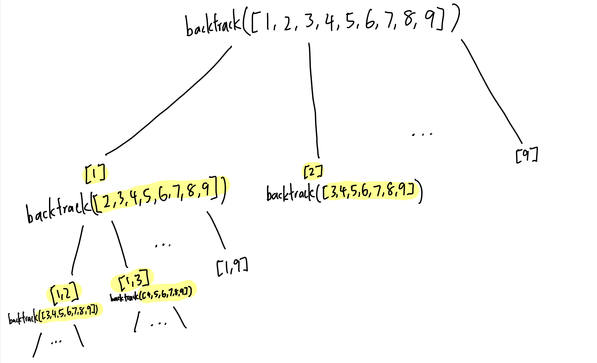
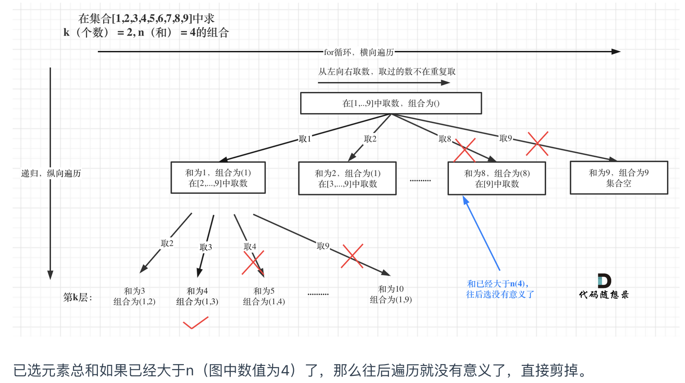

# 216. Combination Sum III
We use `startIndex` to decide the next available range for backtracking.

### way 1: backtracking without prunning
```PYTHON
def combinationSum3(self, k: int, n: int) -> List[List[int]]:
    def backtrack(startIndex, k, n, combination):
        if len(combination) == k:
            if sum(combination) == n:
                res_list.append(combination[:])
            return

        for i in range(startIndex, 10):
            combination.append(i)
            backtrack(i + 1, k, n, combination)
            combination.pop()
    
    res_list = []
    backtrack(1, k, n, [])
    return res_list
```
### way 2: backtracking with prunning
  
```PYTHON
def combinationSum3(self, k: int, n: int) -> List[List[int]]:
    def backtrack(start, k, n, combination, accum):
        if len(combination) == k:
            if accum == n:
                res_list.append(combination[:])
            return

        # prunning 1: 
        # prune when i > last_start
        # e.g. 
        # k = 2, the last_start should be 8
        # k = 3, the last_start should be 7
        last_start = 9 - (k - len(combination)) + 1 
        for i in range(start, last_start + 1):

            # prunning 2:
            if accum + i > n:
                continue

            accum += i
            combination.append(i)
            backtrack(i + 1, k, n, combination, accum)
            combination.pop()
            accum -= i
    
    res_list = []
    backtrack(1, k, n, [], 0)
    return res_list
```

# 17. Letter Combinations of a Phone Number
```PYTHON
def letterCombinations(self, digits: str) -> List[str]:
    def backtrack(index, path, digits):
        if len(path) == len(digits):
            res_list.append("".join(path))
            return

        for alphabet in digit_alpha_dict[digits[index]]:
            path.append(alphabet)
            backtrack(index + 1, path, digits)
            path.pop()

    if not digits:
        return

    digit_alpha_dict = {
        "2": "abc",
        "3": "def",
        "4": "ghi",
        "5": "jkl",
        "6": "mno",
        "7": "pqrs",
        "8": "tuv",
        "9": "wxyz",
    }
    res_list = []
    backtrack(0, [], digits)
    return res_list
```