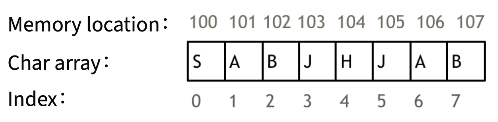
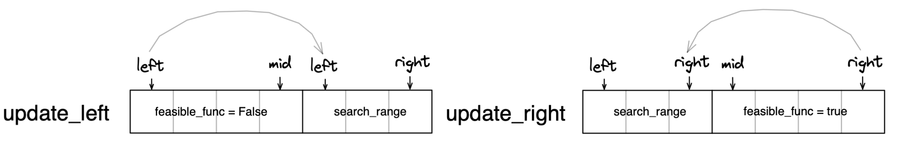
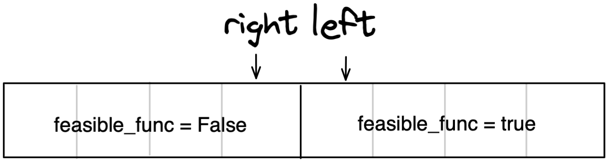

# Array
An array is a collection of similar data elements stored at contiguous regions of memory. Each data element can be accessed directly by using its index number (In most programming languages, array indexes start at zero, aka zero-based indexing).



### Characteristic of Array
Since data elements are stored in the contiguous memory location, the worst case time complexity of insertion and deletion in an array is O(n), as all other data elements may have to be moved for the operations.

# Common algorithms
### Binary method (二分法)
Can only be used in:\
(1) **sorted list** or\
(2) any list which can be transformed to **sorted boolean list** by using specific “feasible function”

#### Description:
The search range is represented by the `left` and `right` pointers that start from both ends of the array. We first define a `feasible_func` that can separate a search range into two part: `feasible_func = False` and `feasible_func = True`. For each iteration, remove half of the current search range by checking the middle item in the current search space.
   
As we search, `left` and `right` move towards each other until the boundary of the two parts, i.e. `left` points to the first element in `feasible_func = True` and `right` points to the last element in `feasible_func = False`.

  

Time complexity: O(log n) * Time complexity of `feasible_func`

#### Pseudocode:
```PYTHON
def feasible_func(array[mid]):
    ...                                      # any functions that can separated 
    ...                                      # the search space into 2 parts
    return boolean_value            

def binary_method(array):
    # loop invariant: [left,right]
    left = 0
    right = len(array) - 1                   # defined by loop invariant

    while (left <= right):                   # defined by loop invariant
        mid = (left + right) // 2

        if (feasible_function ==  True):
            right = mid - 1                  # defined by loop invariant
        else:
            left = mid + 1                   # defined by loop invariant

    # return left or right depends on the feasible function
    return ...                               
```

### Two pointers
#### Description: 
Use one loop to complete jobs that require two nested-loops
by going through a loop with two pointers. Usually, we can reduce the time complexity from from O(n<sup>2</sup>) to O(n).

We compare the elements pointed by the two pointers instead of all the elements between the pointers (compared to [sliding window](#sliding-window)).

#### Classic usage of two pointers:
(1) fast & slow pointers
```PYTHON
def removeDuplicates(self, nums: List[int]) -> int:
    if len(nums) == 1:
        return 1

    slow, fast = 1, 1
    while fast < len(nums):
        if not nums[fast] == nums[fast - 1]:
            nums[slow] = nums[fast]
            slow += 1
        fast += 1

    return slow
```

### Sliding window
#### Description:
There are two types of sliding window:(1) fixed-size sliding window and (2) flexible-size sliding window. For fixed-size sliding window, the algorithms can be implemented with a `start` pointer and a `val` for window size. For flexible-size sliding window, we use `start` and `end` pointers to indicate the starting and ending position of the sliding window, respectively.

Typically we use all of the elements within the window for the problem (e.g. sum of all elements in the window).

Same as [two pointers](#two-pointers), sliding window allows us to convert two nested-loops into a single loop which in turns reduce the time complexity from from O(n<sup>2</sup>) to O(n).

#### Pseudocode:
```PYTHON
def flexible_sliding_window(array):
# loop invariant: start <= end and end < len(array)
    start = 0
    end = 0
    ...
    accum = array[0]
    
    while(start <= end and end < len(array)):

        if (accum >= target):                  # condition to move sliding window forward
            ...
            accum -= array[start]
            start += 1

        else: 
            end += 1
            if (end >= len(array)):    
                break
            accum += array[end]
        
    return ...
```

# Reference
[代码随想录 - 数组理论基础](https://programmercarl.com/数组理论基础.html#数组理论基础)\
[Algomonster - Binary Search and Monotonic Function](https://algo.monster/problems/binary-search-monotonic)\
[StackOverflow - Is two pointer problem same as sliding window](https://stackoverflow.com/questions/64078162/is-two-pointer-problem-same-as-sliding-window)
