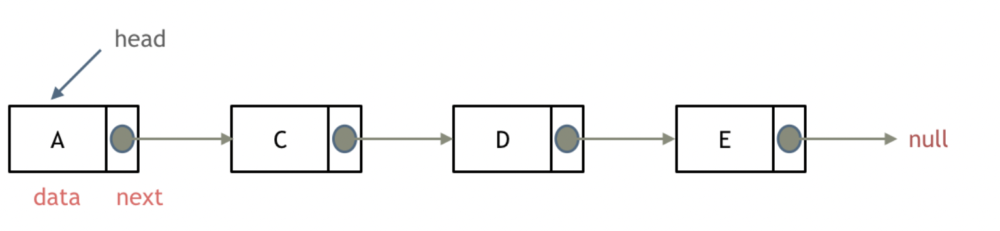
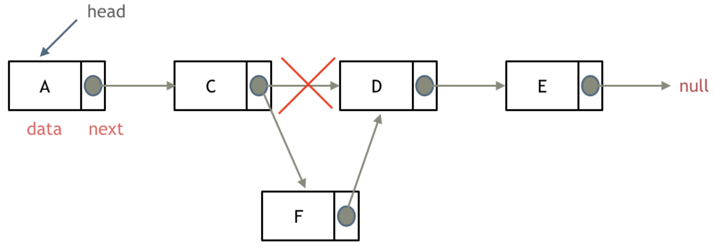
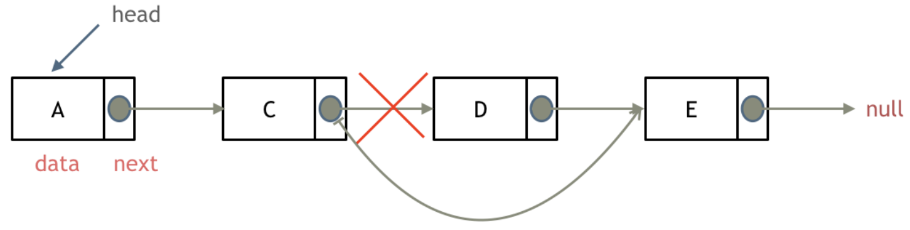

# Linked list
A linked list is a sequence of nodes where each node contains two fields: data field (contain a value) and reference field (contain a link to the next node). The last node is linked to a terminator (normally a null value) used to signify the end of the list.

  

### Operations of Linked List
The insertion and deletion in linked list require both the previous node and the next node of the desired node (see figures). However, a linked list's head node does not have a previous node. Therefore, how we handle the deletion of a head node will differ from how we handle the deletion of a non-head node. 

There are two ways to address this situation:\
(1) Write two separate while loops, one for handling the head node and another one for handling the non-head nodes. \
(2) Add a dummy head node so that the real head node becomes like any other node.

#### Insertion in Linked List
  
#### Deletion in Linked List
  

### Characteristic of Linked List
Unlike Array, the nodes of the Linked List are not stored in the contiguous memory location. This means that Linked Lists do not allow for random access, and accessing each node has a time complexity of O(n). 

Besides, even the insertion and deletion in Linked List only take a time complexity of O(1) but both operations requires iterating through the list from the head to the desired node, which takes O(n) time

# Common algorithms
### Floyd cycle algoritm
To check if there is a cycle in linked list, we can use `fast` and `slow` pointers. Since `fast` pointer moves at double speed of `slow` pointer, they will intersect if and only if there is a cycle, else the `fast` pointer will reach the terminating node (see [Leetcode 142. Linked List Cycle II](./Day4_linked_list.md/#142-linked-list-cycle-ii) for more details).

# Reference
[代码随想录 - 链表](https://programmercarl.com/链表理论基础.html#单链表)\
[wikipedia - linked list](https://en.wikipedia.org/wiki/Linked_list)